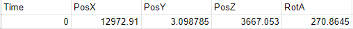
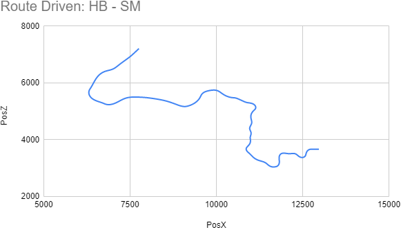
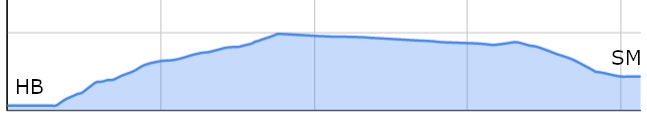
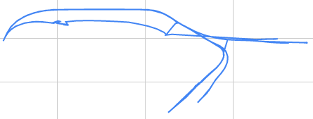
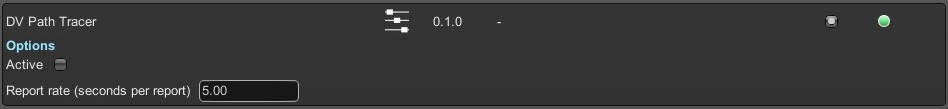

# Derail Valley Path Tracer

This is a mod for the video game Derail Valley created by Altfuture.
It periodically reports information about the path a player has taken through The Valley to a file in its directory.

Download: TBC  
Install using Unity Mod Manager

*This mod uses code for registering custom in-game terminal commands (i.e. **Commands.cs**) created by Miles "Zeibach" Spielberg.*  
*Copyright 2020 Miles Spielberg. Licensed under MIT License.* [Source](https://github.com/mspielberg/dv-steamcutoff/blob/master/Commands.cs)

## What information does it report?

The tracer reports to a .csv file with the following 5 columns:

- `Time` [s] Time since the tracer was activated
- `PosX` [m] Player's current x coordinate (distance from the *West* edge of the map)
- `PosY` [m] Player's current height (above sea level)
- `PosZ` [m] Player's current z coordinate (distance from the *South* edge of the map)
- `RotA` [&deg;] Player's current rotation about the vertical axis, in degrees from North (like a compass)

## What could this information be used for?

Import the file into Google Sheets or equivalent and go ham:

Map the route you took on a job!

Elevation profiles for the route you took!

Timelapse your journey through The Valley!  
(*Some animation ability required*)

## Basic Usage

- To begin tracing the player:
  1. Open the Mod Manager Window with **ctrl-F10**
  3. Check the box 'Active' in this mod's settings
- While active the tracer will periodically write the player's current location to **DVTracedPath.csv** in the folder this mod was installed to  
  *(i.e. /Derail Valley/Mods/DVPathTracer/DVTracedPath.csv)*
  - If the file exists from a previous time the tracer was active then the file will be overwritten
  - See configuration options in the **Advanced Usage** section
- To stop tracing the player:
  1. Open the Mod Manager Window with **ctrl-F10**
  3. Uncheck the box 'Active' in this mod's settings

## Advanced Usage

### GUI Options

In the Mod Manager Window the following settings are available:

- `Active`
  - From the time that this is checked, until it is unchecked or the game is closed, the tracer will periodically write the player's position and rotation to a file in its directory.
- `Report rate`
  - Set the number of seconds between reports

### Basic Commands (in-game terminal)

This mod implements the following commands which can be entered into the in-game terminal:  
**Note: prefix each command with** `DVPathTracer.` (include the dot)

- `whatFile` [default: DVTracedPath.csv]
  - Print the name of the file that the tracer is set to write to.
- `setFileTo` \<fileName\>
  - Set the name of the file that the tracer is set to write to.  
  If the name does not end in .csv, the extention will be added automatically.
- `whatReportInterval` [default: 5]
  - Print the number of seconds that should pass between reports.
- `setReportIntervalTo` \<newInterval\>
  - Set the number of seconds that should pass between reports, must be at least 1.  
  Equivalent to setting a new 'Report rate' in the Mod Manager GUI.
- `isActive`
  - Print whether or not the tracer is currently active.  
  Equivalent to viewing the 'Active' checkbox in the Mod Manager GUI.
- `activate` | `deactivate`
  - Start or stop the tracer respectively.  
  Equivalent to checking/unchecking the 'Active' checkbox in the Mod Manager GUI.
- `playerLocation` | `playerRotation`
  - Print the player's current location or rotation respectively.  
  This does not require the tracer to be active.

### Advanced Commands (in-game terminal)

**Note: prefix each command with** `DVPathTracer.` (include the dot)

- `disablePreventActivationOnStartup`
  - By default, the tracer will always start inactive when the game loads.
  This command disables that, allowing it to remember its active state through a game restart.  
  Any existing .csv file with the same name will still be overwritten.  
  Be wary of unusual values in .csv output during the time that the game spent loading.
- `enablePreventActivationOnStartup`
  - Re-enable the forced start-inactive behaviour that was disabled with the command above.
- `reportHere`
  - Print what would be written to the file if the tracer were running.  
  This command does not require the tracer to be active.
  As such the 'Time' entry is the time since Derail Valley was started, not the active time.

## Future Plans

- Add ability to trace locomotives and the caboose
  - *Possibly* also active job cars
- Add ability to change the filename in GUI options
- See if I can create something to animate this information
