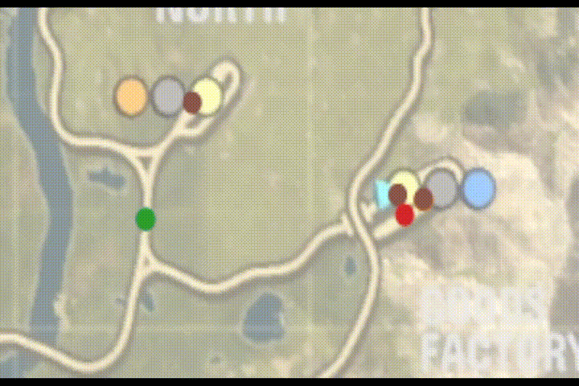

# Derail Valley Path Tracer

**Note:** Preparing for 0.2.0 release, the information here does not match the current released version of this mod.
After 0.2.0 I will move to a proper main/develop repo structure.

This is a mod for the video game Derail Valley created by Altfuture.  
It periodically reports information about the player's journey through The Valley to a file in its directory.

Download: [Nexus Mods](https://www.nexusmods.com/derailvalley/mods/425)  
Install using [Unity Mod Manager](https://www.nexusmods.com/site/mods/21)

## What could this information be used for?

Map the routes you took, or timelapse your journey through The Valley, with the included animation tool!

**But** if you want to have a go yourself there's plenty of information to look at that the included tool doesn't touch.  
Import the file into Google Sheets or equivalent and go ham!

## Basic Usage

### Path Tracer

- As of version 0.2.0 the tracer is always active by default.
  - This can be changed in the mod settings.
- While active, the tracer will periodically write information to **DVTracedPath.csv** in the folder this mod was installed to.  
  *(i.e. /Derail Valley/Mods/DVPathTracer/DVTracedPath.csv)*
  - If the file exists from a previous time the tracer was active then the file will be overwritten

### Path Animator

- The included path timelapsing tool can be found in the folder **PathAnimator** in the folder this mod was installed to.  
  *(i.e. /Derail Valley/Mods/DVPathTracer/PathAnimator/)*
  - For simplicity it is a static webpage hosted on your computer.
- Open the file **PathAnimator.html** with your browser (Chrome etc).
- Import your traced path manually or by dragging & dropping.
- For a background image, import the included world map (**worldMap.png**) using the same method.

## What information does it report?

The tracer reports to a .csv file with the following information:

### Player information

The first 5 columns indicate information about you, the player:

- `Time` [s] Time since the tracer was activated.
- `PPosX` [m] Player's current x coordinate (distance from the *West* edge of the map).
- `PPosY` [m] Player's current height (above sea level).
- `PPosZ` [m] Player's current z coordinate (distance from the *South* edge of the map).
- `PRotA` [&deg;] Player's current rotation about the vertical axis, in degrees from North (like a compass).

### Rolling stock information:

The following columns indicate information about all spawned locomotives and the caboose, in sets of 7:

- `CID` The object's in-game identifier (e.g. **L-001**).
- `CType` The type of rolling stock (e.g. **DE2**).  
  ***Note:** The tracer will report a string of numbers for modded locos.  
  This will be fixed in a future update.*
- `CPosX` [m] Current x coordinate (distance from the *West* edge of the map).
- `CPosY` [m] Current height (above sea level).
- `CPosZ` [m] Current z coordinate (distance from the *South* edge of the map).
- `CRotA` [&deg;] Current rotation about the vertical axis, in degrees from North (like a compass).
- `CSpd` [Default: kph] Current reported speed.
  - Imperial units can be enabled in the mod settings.

Order is preserved to an extent - information about each object will occupy the same column it started in until that object despawns.
After the object despawns, until a new object takes its place, the tracer will fill that space with the column headings listed above.

## Future Plans

- Improve ability to trace across multiple sessions.
- More included analysis tools.
- *Potentially* add tracing of active job cars.

## Many thanks

This mod uses code for registering custom in-game terminal commands (i.e. **Commands.cs**) created by Miles "Zeibach" Spielberg.  
This and other resources used for this mod are listed in `LICENSE_THIRD_PARTY`.
